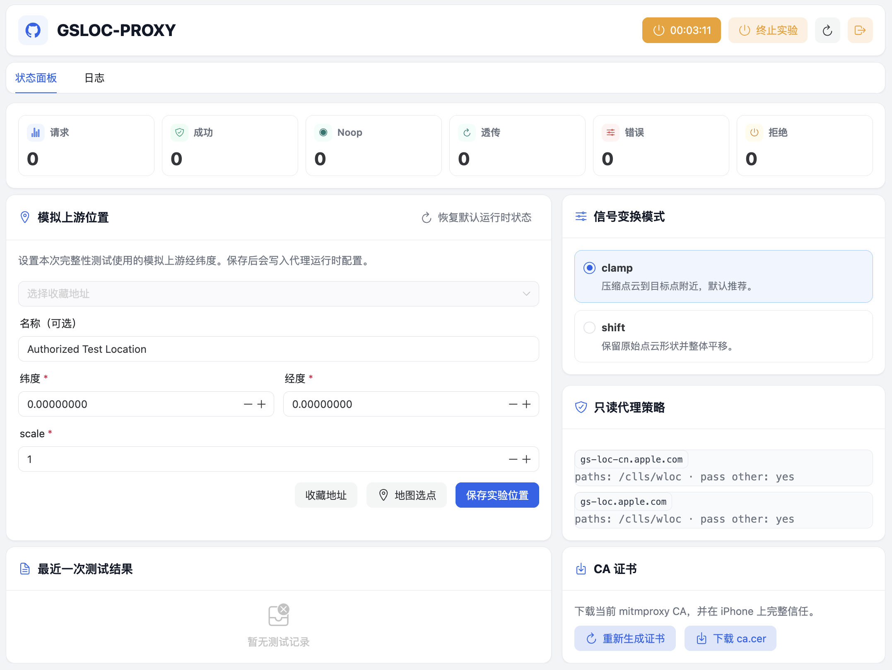

# GSLOC-PROXY

`GSLOC-PROXY` 是一个用于授权实验环境的网络层定位完整性测试代理。它帮助移动应用开发者、安全研究者和风控团队复现一种特定威胁模型：应用本身没有被 Hook、注入或使用系统模拟定位，但系统定位依赖的上游网络信号在受控实验网络中被修改。



本项目的重点不是证明“定位可以被修改”，而是帮助开发者验证自己的应用是否过度信任系统定位结果，以及是否具备足够的多源校验、风险评分和异常处理能力。

> 本项目只面向自有设备、自有应用、授权账号和受控实验网络中的安全研究、防御测试和风控鲁棒性验证。
>
> 本项目不面向，也不应被用于绕过打卡、游戏、金融、配送平台、地区限制、反作弊、平台风控或任何第三方应用策略。
>
> 维护者不会为未授权使用、违法使用、侵害第三方权益的使用，或以规避第三方策略为目的的使用提供协助。使用者必须自行确保其测试环境、设备、账号、网络和目标应用均具备合法授权，并遵守所在国家或地区的适用法律法规。

## 项目定位

移动应用通常会检测本机层面的篡改迹象，例如越狱、调试、Hook、动态库注入、系统模拟定位等。但“没有检测到本机篡改”并不等于“系统定位结果一定可信”。

`GSLOC-PROXY` 用代理方式模拟网络层上游定位信号被篡改的场景，使开发者可以在授权实验环境中观察自家应用的风险控制表现。它适合用于：

- 定位完整性测试；
- 移动应用位置风控鲁棒性验证；
- 系统定位信任边界研究；
- 多源位置可信度评分方案的防御性测试；
- 安全研究报告或内部风控演练中的可复现实验环境。

它不适合也不应被用于：

- 公共代理服务；
- 通用 HTTPS MITM 代理；
- 绕过任何第三方应用规则；
- 规避平台风控、反作弊或区域限制；
- 收集、保存或分析他人设备、账号或网络数据。

## 工作方式

在授权测试设备上，用户使用自己控制的网络工具将 Apple 定位相关端点的请求转发到本地或可信实验网络中的 `GSLOC-PROXY`。代理只允许配置中的定位服务 host，并只在配置路径上执行实验性响应处理。

当前实现基于 `mitmproxy regular mode`：

- HTTP CONNECT 代理入口；
- host allowlist；
- 路径 allowlist；
- gzip 解压和重新压缩；
- 对已识别的定位响应结构执行实验性信号变换；
- Web 控制台用于查看状态、管理实验位置和下载本地 CA 证书。

实验链路依赖授权测试设备主动安装并信任本地实验 CA；未完成该配置时，相关 HTTPS 测试流量不会被代理处理。

## 安全边界

- 代理入口默认监听 `127.0.0.1`；
- 管理 Web/API 默认监听 `127.0.0.1`；
- 管理控制台支持用户名/密码登录；设置 `GSLOC_MANAGE_PASSWORD` 后启用；
- 非 allowlist host 会被拒绝，避免退化为通用代理；
- 示例仅面向本地或可信局域网中的授权设备。

如果你需要让手机访问本机代理或控制台，请只在可信局域网中临时监听 `0.0.0.0`，并确保网络环境、设备和账号均由你控制且获得授权。不要将本服务暴露到公网。

## 快速开始

### 1. 创建虚拟环境

不要直接用系统 Python 全局安装依赖。推荐使用项目脚本创建隔离环境：

```bash
cd proxy
./setup-venv.sh
```

### 2. 准备本地配置

```bash
cp .env.example .env
cp policy.example.json policy.json
cp state.example.json state.json
```

默认管理控制台监听：

```text
http://127.0.0.1:8090/
```

默认代理端口：

```text
127.0.0.1:8082
```

### 3. 启动代理

```bash
./run-local.sh
```

启动后可以在控制台中生成或下载当前 mitmproxy CA 证书。授权测试设备需要安装并信任该 CA，否则 HTTPS 实验链路无法建立。

## 配置说明

### `.env`

控制进程启动参数，例如代理端口、管理 Web/API 监听地址、控制台登录、策略文件路径、运行时状态路径、mitmproxy 配置目录、重启标记文件和日志级别/文件日志。

管理控制台默认用户名为 `admin`。`GSLOC_MANAGE_PASSWORD` 留空时不要求登录，只适合默认 `127.0.0.1` 本机访问；如果将 `GSLOC_MANAGE_HOST` 改为 `0.0.0.0` 供可信局域网设备访问，请设置强密码：

```bash
GSLOC_MANAGE_USER=admin
GSLOC_MANAGE_PASSWORD=change-this-to-a-long-random-password
```

### `policy.json`

定义代理允许处理的 host 和 path。公开版本应保持严格 allowlist，不应扩展为通用代理。

### `state.json`

保存运行时实验状态，包括是否启用、模拟上游位置、信号变换模式和缩放参数。

## Web 控制台

Web 控制台提供以下功能：

- 查看代理和实验状态；
- 设置本次完整性测试使用的模拟上游位置；
- 切换信号变换模式；
- 查看最近一次测试结果；
- 查看 allowlist 策略；
- 生成或下载本地 mitmproxy CA 证书；
- 查看运行日志。

控制台是实验辅助界面，不应暴露到公网。远程访问场景应自行增加访问控制，例如反向代理认证、内网访问限制或其他授权机制。

## 客户端路由

本项目不提供通用代理服务，也不接管设备全局流量。授权测试设备应使用用户自己控制的网络工具，仅将实验所需的定位服务请求转发到 `GSLOC-PROXY`。

仓库中的 `docs/example/sing-box-1.13.json` 是本地实验路由示例。请根据你的授权测试环境调整地址、端口和网络范围。

## 防御建议

应用不应仅凭“未检测到越狱、Hook、调试或系统模拟定位”就判定位置可信。更稳妥的做法是将位置可信度作为服务端风险评分的一部分，并结合多源信号进行判断。

可考虑的检测和缓解方向包括：

- 系统定位与 IP geolocation、ASN、网络环境的一致性；
- 轨迹连续性、速度、加速度、方向、海拔、精度和时间戳异常；
- impossible travel；
- 多账号或多设备重复使用相同位置；
- 同一代理出口或异常网络环境下的大量账号行为；
- Wi-Fi、蜂窝、motion sensor 和业务上下文的多源风险评分；
- 对高风险位置相关操作触发 step-up verification；
- 将 jailbreak、mock location、hooking 检测视为其中一层，而非充分证明。

核心观点：

> 没有任何单一信号可以证明移动设备上报的位置一定真实。定位可信度应基于设备、网络、行为和历史轨迹等多源信号的一致性进行评分。

## 开发

后端：

```bash
cd proxy
./setup-venv.sh
./run-local.sh
```

前端：

```bash
cd web
npm install
npm run dev
```

构建前端静态文件：

```bash
cd web
npm run build
```

构建产物会输出到 `proxy/gsloc_proxy/static/`，该目录默认不进入仓库。

## 许可

本项目使用 MIT License 发布。

MIT 许可只说明软件版权授权，不代表维护者认可任何未授权、违法或侵害第三方权益的使用方式。使用者必须自行确保其测试环境、设备、账号、网络和目标应用均具备合法授权，并遵守所在国家或地区的适用法律法规。
